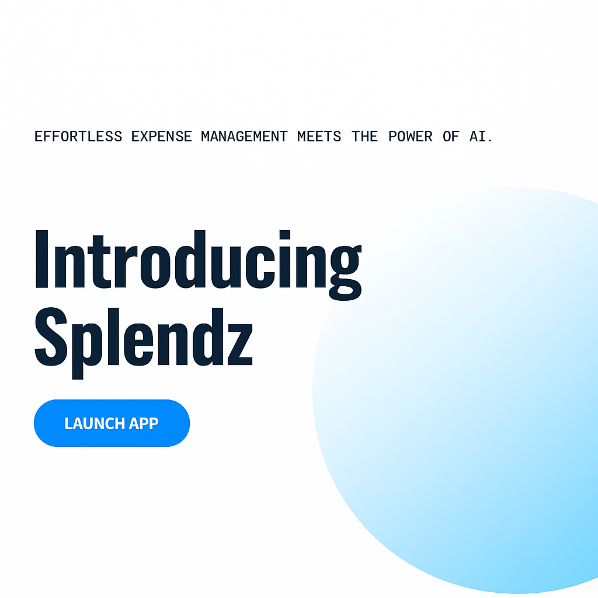

# Splendz  – AI Expense Splitting App

[](https://pay-split-ai-r1sh.vercel.app/)

**Splendz** is a modern, AI-powered event planning and expense-sharing platform that makes organizing events—from casual hangouts to large parties—seamless and stress-free. With real-time coordination, intelligent budgeting, task tracking, and smart settlement features, Splendz helps you focus on the fun, not the fuss. Built with cutting-edge tech like Next.js, Convex, Gemini AI, and ShadCN UI, it delivers lightning-fast performance and a stunning UI across all devices.

---

>  **Effortless expense splitting meets the power of AI.**

---

##  Features

 **Event Creation & Management**: Plan events, add tasks, set budgets & assign roles.  
 **Smart Scheduling Assistant**: Find the best date and time using AI-based suggestions.  
 **Shared Budget & Expense Tracking**: Allocate budgets, track group expenses, and settle up easily.  
 **AI-Driven Recommendations**: Venue, task, and vendor suggestions based on your event type.  
 **Smart Debt Simplification**: One-click optimization to reduce transactions.  
 **Analytics Dashboard**: Visualize tasks, expenses, and budget usage.  
 **AI-Generated Reminders**: Email & in-app alerts using RESEND.  
 **Group Management**: Assign roles and track progress collaboratively.  
 **Fully Responsive UI**: Beautiful on desktop, tablet, and mobile.

---

##  Tech Stack

| Tech          | Description                              |
|---------------|------------------------------------------|
| Next.js       | React Framework for frontend             |
| Tailwind CSS  | Utility-first CSS framework              |
| ShadCN UI     | Stunning pre-built UI components         |
| TypeScript    | Type-safe development                    |
| Convex        | Real-time backend and data sync          |
| Gemini AI     | Personalized insights and suggestions    |
| Resend        | Transactional emails for reminders       |
| Inngest       | Serverless workflows and automation      |
| Vercel        | Deployment and hosting                   |

---

##  How It Works

1. **Create an Event**: Set the name, date, and type of event.  
2. **Invite Friends**: Add participants and assign roles.  
3. **Plan & Assign Tasks**: Use checklists and scheduling tools.  
4. **Set Budget & Track Spending**: Add expenses and see how funds are used.  
5. **AI Recommendations**: Get venue, schedule, and task ideas.  
6. **Smart Settlements**: Simplify who owes whom.  
7. **Get Reminders**: Stay on track with AI-powered notifications.

---

##  Local Development

```bash
# Clone the repo
git clone https://github.com/<your-username>/splendz.git

# Navigate to the project folder
cd splendz

# Install dependencies
npm install

# Run the development server
npm run dev
```

---

##  Environment Variables

Create a `.env` file at the root and add:

```env
# Convex Deployment
CONVEX_DEPLOYMENT=
NEXT_PUBLIC_CONVEX_URL=

# Clerk Auth Keys
NEXT_PUBLIC_CLERK_PUBLISHABLE_KEY=
CLERK_SECRET_KEY=

NEXT_PUBLIC_CLERK_SIGN_IN_URL=/sign-in
NEXT_PUBLIC_CLERK_SIGN_UP_URL=/sign-up
CLERK_JWT_ISSUER_DOMAIN=

# Gemini & Email
GEMINI_API_KEY=
RESEND_API_KEY=
```

---

##  Contact & Support

Want to collaborate or suggest a feature? Open an issue or pull request!  
Email: amithp0210@gmail.com

---

**Built by Amith and the Splendz team.**
